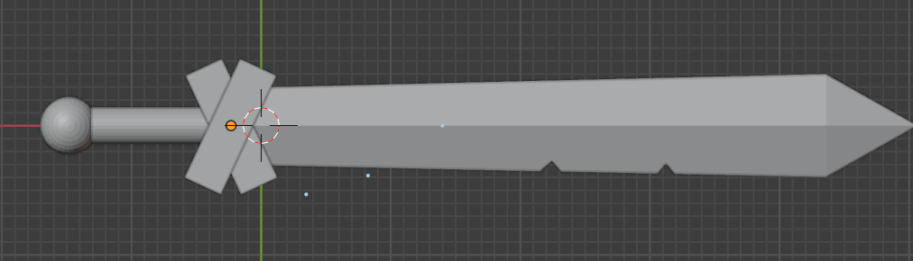
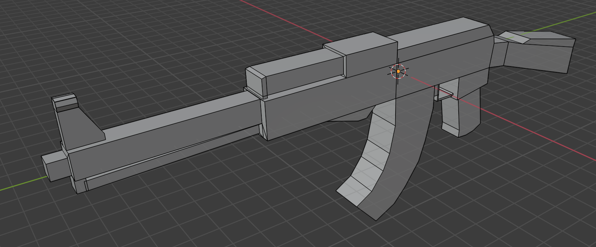
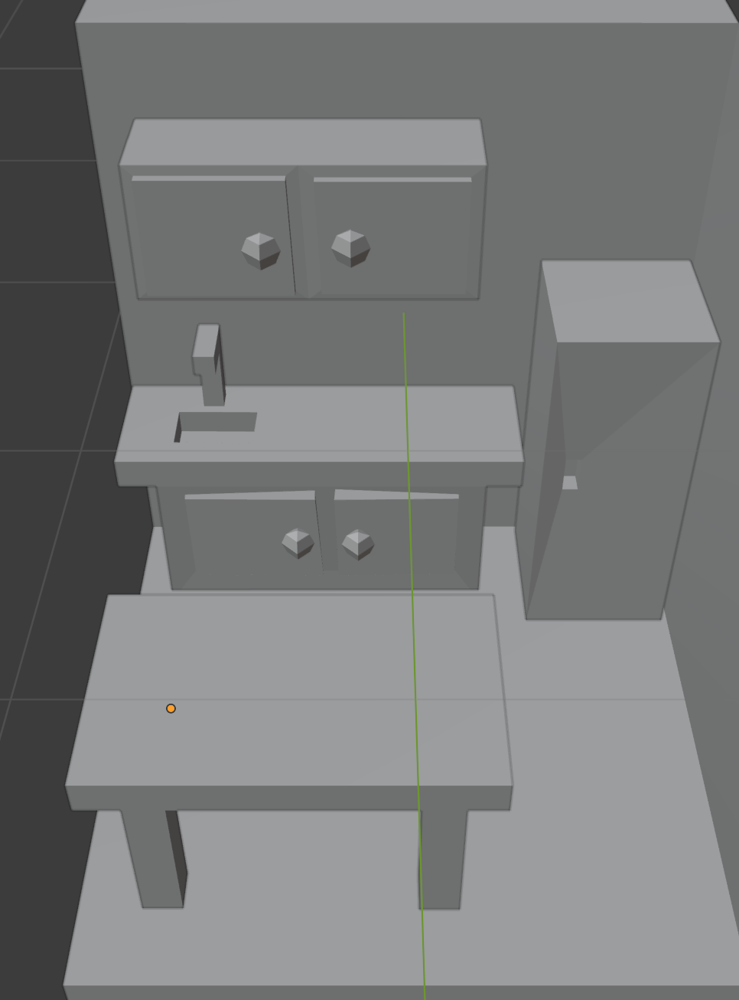
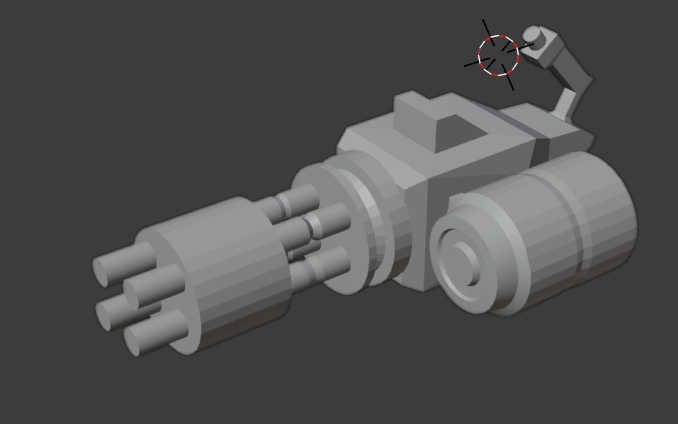
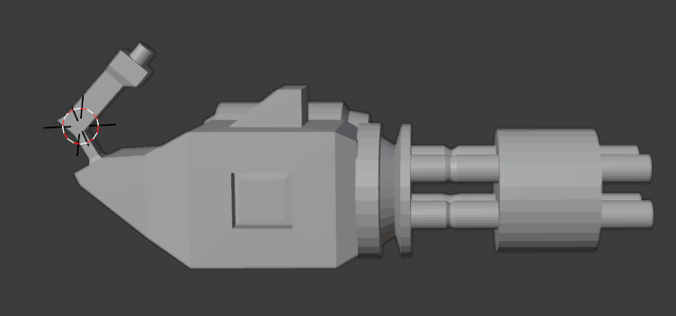

## Hello! My name is Alexander Kang! 👋

 
Hello there I am currently an eigth grader attending a middle school. I like to make games using <strong>Unity's game engine<strong/> which uses <strong>C#<strong/>, use <strong>blender<strong/>.

---

## About Me

- 8th grade attending a middle school
- Video game enthusiast
- Uses Blender to make models
- Makes games with Unity's game engine and C#
- I use Visual Studio Codes for most of my coding

## Ongoing Projects

- Improving Python
- Making a game called game01(doesn't have a name)
- Improving on coding overall

## Goals

- Get better at Python
- Finish making a game
- Get a title for the game

## Languages and Tools

## Some Models I Have Made

